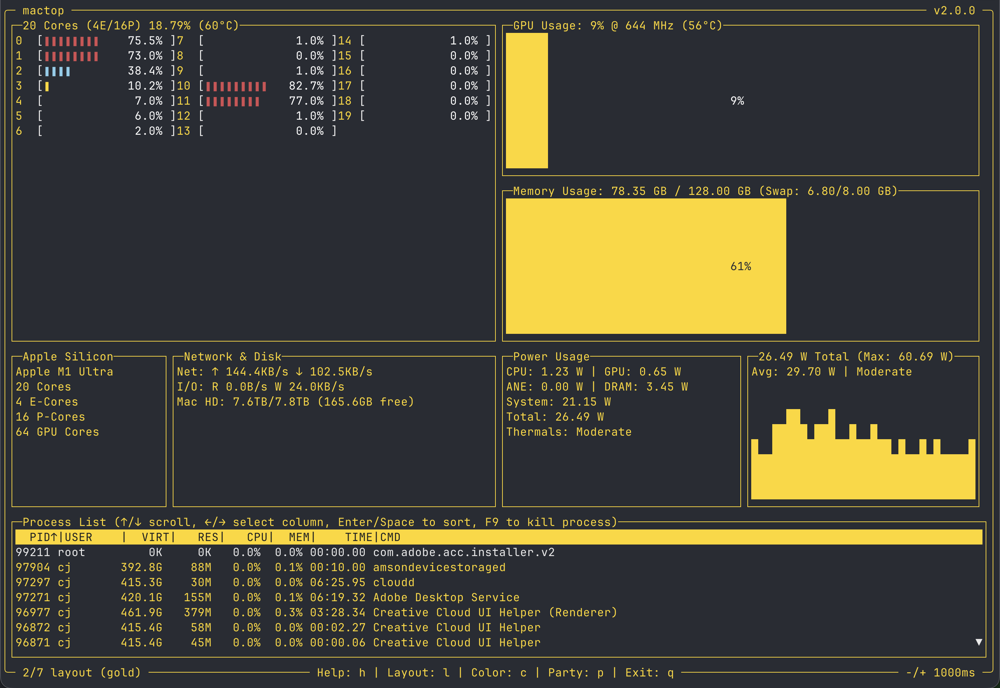

# mactop

[](https://goreportcard.com/report/github.com/metaspartan/mactop/v2)
[](https://godoc.org/github.com/metaspartan/mactop/v2)
 

`mactop` is a terminal-based monitoring tool "top" designed to display real-time metrics for Apple Silicon chips written by Carsen Klock. It provides a simple and efficient way to monitor CPU and GPU usage, E-Cores and P-Cores, power consumption, GPU frequency, temperatures, and other system metrics directly from your terminal


## Compatibility

- Apple Silicon Only (ARM64)
- macOS Monterey 12.3+

## Features

- **No sudo required** - Uses native Apple APIs (SMC, IOReport, IOKit, IOHIDEventSystemClient)
- Apple Silicon Monitor Top written in Go Lang and CGO
- Real-time CPU, GPU, ANE, DRAM, and system power wattage usage display
- GPU frequency and usage percentage display
- CPU and GPU temperatures + Thermal State
- Detailed native metrics for CPU cores (E and P cores) via Apple's Mach Kernel API
- Memory usage and swap information
- Network usage information (upload/download speeds)
- **Thunderbolt bandwidth monitoring**: Real-time throughput for Thunderbolt Bridge interfaces
- **Thunderbolt Device Tree**: Visual tree of connected Thunderbolt/USB4 devices and their speeds
- **RDMA Support**: Detection of RDMA over Thunderbolt 5 availability
- Disk I/O activity (read/write speeds)
- Multiple volume display (shows Mac HD + mounted external volumes)
- Easy-to-read terminal UI
- **10 Layouts**: (`L` to cycle layouts)
- **Persistent Settings**: Remembers your Layout and Theme choice across restarts
- Customizable UI color (green, red, blue, skyblue, magenta, yellow, gold, silver, white, lime, orange, violet, and pink) (`C` to cycle colors)
- Customizable update interval (default is 1000ms) (`-` or `=` to speed up, `+` to slow down)
- Process list matching htop format (VIRT in GB, CPU normalized by core count)
- **Process Management**: Kill processes directly from the UI (F9). List pauses while selecting.
- **Headless Mode**: Output JSON metrics to stdout for scripting/logging (`--headless`)
- **JSON Formatting**: Pretty print JSON output (`--pretty`) or set collection count (`--count <n>`)
- Party Mode (Randomly cycles through colors) (P to toggle)
- Optional Prometheus Metrics server (default is disabled) (`-p <port>` or `--prometheus <port>`)
- Support for all Apple Silicon models
- **Auto-detect Light/Dark Mode**: Automatically adjusts UI colors based on your terminal's background color or system theme.
- **Configurable Units**: Customize units for network, disk, and temperature display (`--unit-network`, `--unit-disk`, `--unit-temp`)

## Install via Homebrew

You can install [mactop](https://github.com/metaspartan/mactop) via Homebrew! https://brew.sh

```bash
brew install mactop
```

```bash
mactop
```

## Updating via Homebrew

```bash
brew update
```

```bash
brew upgrade mactop
```

## Installation

To install `mactop`, follow these steps:

1. Ensure you have Go installed on your machine. If not, you can install it by following the instructions here: [Go Installation Guide](https://go.dev/doc/install).

2. Clone the repository:
   ```bash
   git clone https://github.com/metaspartan/mactop.git
   cd mactop
   ```

3. Build the application:
   ```bash
   go build
   ```

4. Run the application:
   ```bash
   ./mactop
   ```

## Usage

After installation, you can start `mactop` by simply running:
```bash
./mactop
```

Example with flags:
```bash
mactop --interval 1000 --color green
```

Headless Mode (JSON Output):
```bash
# Run once and exit (great for scripts)
mactop --headless --count 1

# Run continuously with pretty printing
mactop --headless --pretty
```

## mactop Flags

- `--headless`: Run in headless mode (no TUI, output JSON to stdout).
- `--count`: Number of samples to collect in headless mode (0 = infinite).
- `--interval` or `-i`: Set the update interval in milliseconds. Default is 1000.
- `--color` or `-c`: Set the UI color. Default is white. 
Options are 'green', 'red', 'blue', 'skyblue', 'magenta', 'yellow', 'gold', 'silver', 'white', 'lime', 'orange', 'violet', and 'pink'. (-c green)
- `--prometheus` or `-p`: Set and enable the local Prometheus metrics server on the given port. Default is disabled. (e.g. -p 2112 to enable Prometheus metrics on port 2112)
- `--unit-network`: Network unit: auto, byte, kb, mb, gb (default: auto)
- `--unit-disk`: Disk unit: auto, byte, kb, mb, gb (default: auto)
- `--unit-temp`: Temperature unit: celsius, fahrenheit (default: celsius)
- `--test` or `-t`: Test IOReport power metrics (no sudo required)
- `--version` or `-v`: Print the version of mactop.
- `--help` or `-h`: Show a help message about these flags and how to run mactop.

## mactop Commands
Use the following keys to interact with the application while its running:
- `q`: Quit the application.
- `r`: Refresh the UI data manually.
- `c`: Cycle through the color themes.
- `p`: Party Mode (Randomly cycles through colors)
- `i`: Toggle Info layout (displays system info)
- `l`: Cycle through the 10 available layouts.
- `+` or `=`: Increase update interval (slower updates).
- `-`: Decrease update interval (faster updates).
- `F9`: Kill the currently selected process (pauses updates while selecting).
- `Arrow Keys` or `h/j/k/l`: Navigate the process list and select columns.
- `Enter` or `Space`: Sort by the selected column.
- `h` or `?`: Toggle the help menu.

## Example Theme (Green) Screenshot (mactop -c green) on Advanced layout (Hit "l" key to toggle)



## Example Headless Output (mactop --headless --count 1)

```json
[{
  "timestamp": "2025-12-22T16:15:19-07:00",
  "soc_metrics": {
    "cpu_power": 3.287,
    "gpu_power": 6.03673986,
    "ane_power": 0,
    "dram_power": 5.942,
    "gpu_sram_power": 0.171,
    "system_power": 19.749001564560547,
    "total_power": 35.18574142456055,
    "gpu_freq_mhz": 643,
    "soc_temp": 63.620026,
    "cpu_temp": 63.620026,
    "gpu_temp": 58.701385
  },
  "memory": {
    "total": 137438953472,
    "used": 73420537856,
    "available": 64018415616,
    "swap_total": 5368709120,
    "swap_used": 4094689280
  },
  "net_disk": {
    "out_packets_per_sec": 559.0413919758663,
    "out_bytes_per_sec": 168844.68166702875,
    "in_packets_per_sec": 585.1648215074488,
    "in_bytes_per_sec": 71770.01752766805,
    "read_ops_per_sec": 0.7463837009023582,
    "write_ops_per_sec": 0.7463837009023582,
    "read_kbytes_per_sec": 2.9855348036094327,
    "write_kbytes_per_sec": 11.94213921443773
  },
  "cpu_usage": 14.28650909913759,
  "gpu_usage": 58.98631111171196,
  "core_usages": [
    41.28787878787879,
    36.74242424242424,
    56.015037593984964,
    35.84905660377358,
    23.77358490566038,
    18.49056603773585,
    11.985018726591761,
    5.223880597014925,
    3.3457249070631967,
    1.858736059479554,
    29.32330827067669,
    18.49056603773585,
    1.1194029850746268,
    1.1152416356877324,
    0,
    0.37174721189591076,
    0,
    0,
    0,
    0.7380073800738007
  ],
  "system_info": {
    "name": "Apple M1 Ultra",
    "core_count": 20,
    "e_core_count": 4,
    "p_core_count": 16,
    "gpu_core_count": 64
  },
  "thermal_state": "Normal",
  "thunderbolt_info": {
    "buses": [
      {
        "name": "TB4 Bus 5",
        "status": "Active (USB)",
        "icon": "⏺",
        "speed": "Up to 40 Gb/s",
        "devices": [
          {
            "name": "ASM236X NVME",
            "mode": "USB",
            "info_string": "USB, SSD"
          }
        ],
        "network_stats": {
          "interface_name": "en7",
          "bytes_in": 0,
          "bytes_out": 0,
          "bytes_in_per_sec": 0,
          "bytes_out_per_sec": 0,
          "packets_in": 0,
          "packets_out": 0
        }
      },
      {
        "name": "TB4 Bus 4",
        "status": "Inactive",
        "icon": "○",
        "speed": "Up to 40 Gb/s",
        "network_stats": {
          "interface_name": "en6",
          "bytes_in": 0,
          "bytes_out": 0,
          "bytes_in_per_sec": 0,
          "bytes_out_per_sec": 0,
          "packets_in": 0,
          "packets_out": 0
        }
      },
      {
        "name": "TB4 @ TB3 Bus 3",
        "status": "Active",
        "icon": "ϟ",
        "speed": "20 Gb/s",
        "devices": [
          {
            "name": "Studio Display",
            "vendor": "Apple Inc.",
            "mode": "TB3",
            "info_string": "Apple Inc., TB3"
          }
        ],
        "network_stats": {
          "interface_name": "en5",
          "bytes_in": 0,
          "bytes_out": 0,
          "bytes_in_per_sec": 0,
          "bytes_out_per_sec": 0,
          "packets_in": 0,
          "packets_out": 0
        }
      },
      {
        "name": "TB4 Bus 2",
        "status": "Inactive",
        "icon": "○",
        "speed": "Up to 40 Gb/s",
        "network_stats": {
          "interface_name": "en4",
          "bytes_in": 0,
          "bytes_out": 0,
          "bytes_in_per_sec": 0,
          "bytes_out_per_sec": 0,
          "packets_in": 0,
          "packets_out": 0
        }
      },
      {
        "name": "TB4 Bus 1",
        "status": "Inactive",
        "icon": "○",
        "speed": "Up to 40 Gb/s",
        "network_stats": {
          "interface_name": "en3",
          "bytes_in": 0,
          "bytes_out": 0,
          "bytes_in_per_sec": 0,
          "bytes_out_per_sec": 0,
          "packets_in": 0,
          "packets_out": 0
        }
      },
      {
        "name": "TB4 Bus 0",
        "status": "Inactive",
        "icon": "○",
        "speed": "Up to 40 Gb/s",
        "network_stats": {
          "interface_name": "en2",
          "bytes_in": 0,
          "bytes_out": 0,
          "bytes_in_per_sec": 0,
          "bytes_out_per_sec": 0,
          "packets_in": 0,
          "packets_out": 0
        }
      }
    ]
  },
  "tb_net_total_bytes_in_per_sec": 0,
  "tb_net_total_bytes_out_per_sec": 0,
  "rdma_status": {
    "available": false,
    "status": "RDMA Disabled (use rdma_ctl enable in Recovery Mode)"
  },
  "cpu_temp": 63.620026,
  "gpu_temp": 58.701385
}
]
```

## Confirmed tested working M series chips

- M1
- M1 Pro
- M1 Max
- M1 Ultra
- M2
- M2 Pro
- M2 Max
- M2 Ultra
- M3
- M3 Pro
- M3 Max
- M3 Ultra
- M4
- M4 Pro
- M4 Max
- M5

(If you have a confirmed working M series chip that is not listed, please open an issue, so we may add it here!)

## Contributing

Contributions are what make the open-source community such an amazing place to learn, inspire, and create. Any contributions you make are **greatly appreciated**.

1. Fork mactop
2. Create your Feature Branch (`git checkout -b feature/AmazingFeature`)
3. Commit your Changes (`git commit -m 'Add some AmazingFeature'`)
4. Push to the Branch (`git push origin feature/AmazingFeature`)
5. Open a Pull Request

## What does mactop use to get real-time data?

- **Apple SMC**: For SoC temperature sensors and System Power (PSTR)
- **IOReport API**: For CPU, GPU, ANE, and DRAM power consumption (no sudo required)
- **IOKit**: For GPU frequency table from `pmgr` device
- **IOHIDEventSystemClient**: Fallback for SoC temperature sensors
- **NSProcessInfo.thermalState**: For system thermal state (Nominal/Fair/Serious/Critical)
- **Mach Kernel API** (`host_processor_info`): For CPU metrics (E and P cores) via CGO
- **gopsutil**: For memory, swap, network, and disk I/O metrics
- **ps**: For process list information
- `sysctl`: For CPU model information
- `system_profiler`: For GPU Core Count

## License

Distributed under the MIT License. See `LICENSE` for more information.

## Author and Contact

Carsen Klock - [@carsenklock](https://x.com/carsenklock)

Project Link: [https://github.com/metaspartan/mactop](https://github.com/metaspartan/mactop)

## Disclaimer

This tool is not officially supported by Apple. It is provided as is, and may not work as expected. Use at your own risk.

## Acknowledgements

- [gotui](https://github.com/metaspartan/gotui) for the modern terminal UI framework.
- [termui](https://github.com/gizak/termui) for the original terminal UI framework.
- [gopsutil](https://github.com/shirou/gopsutil) for system memory, network, and disk monitoring.
- [asitop](https://github.com/tlkh/asitop) for the original inspiration!
- [htop](https://github.com/htop-dev/htop) for the process list and CPU cores inspiration!
